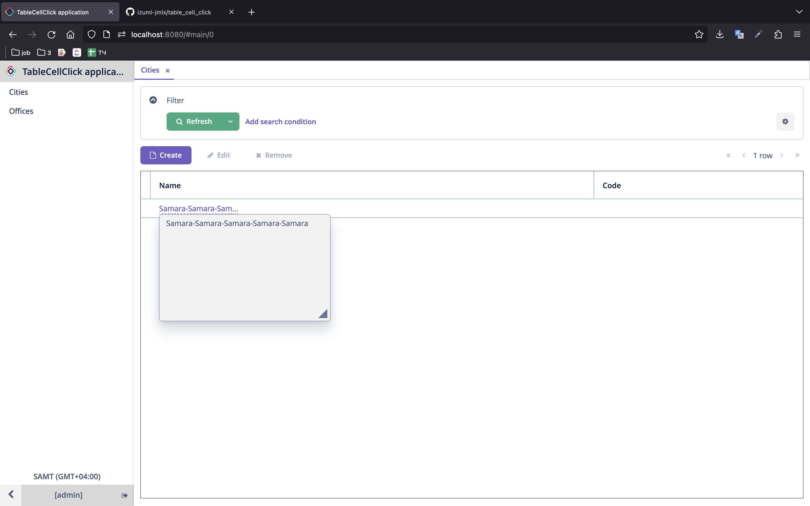
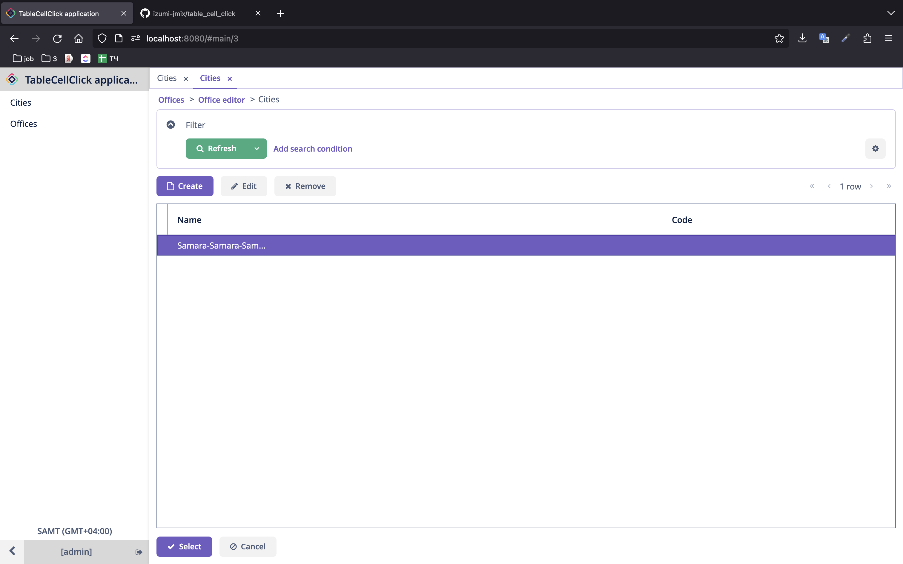
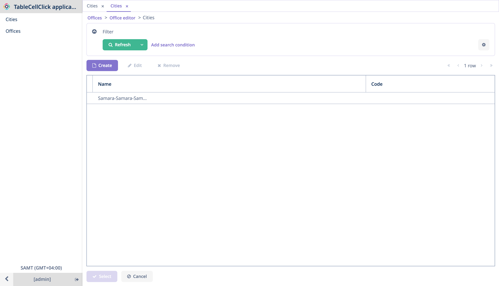

### Used:
* Jmix v. 1.5.3
* Java v. 11 (BellSoft Liberica)
* Jmix Classic UI

### The problem:
A text value display of a column in Jmix Table can be limited by "maxTextLength" property. And user will be able to view full text value. But it works not always. 

In case you open a browse-screen in browse-mode (not for picking values) there will be an opportunity to check full text. 

In case you open a browse-screen in lookup-mode (to pickup value, for example, to a field) there won't be any opportunity to check full text. 

### Steps to reproduce:
* Launch application.
* Open the application in browser.
* Cities browser will be opened automatically in browser-mode. Click on name cell of the single existing row. You will see a popup with full value.

* Open officies browse screen (Offices in menu).
* Open the single existing office in editor.
* Click on button to pickup a city for the office. Cities browser will be opened in lookup-mode. Click on name cell of the single existing row. You won't see a popup with full value.

